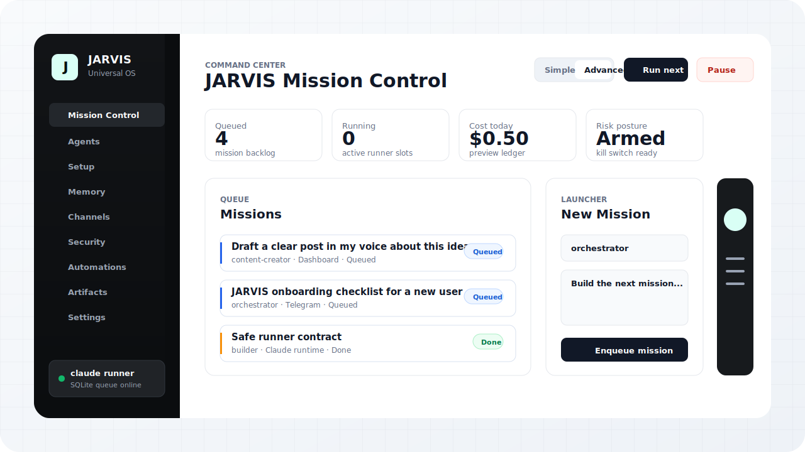
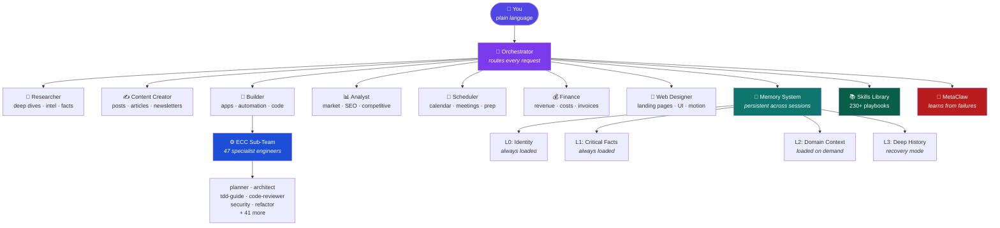

<div align="center">

<h1>JARVIS Universal</h1>

<p>
  <strong>A local-first agentic operating system for Claude Code, Codex, and Cowork.</strong>
</p>

<p>
  Specialist agents, persistent memory, self-healing skills, a safe mission queue, and a premium Control Center dashboard.
</p>

<p>
  <a href="#quick-start"><strong>Quick Start</strong></a>
  ·
  <a href="#control-center"><strong>Control Center</strong></a>
  ·
  <a href="#what-you-get"><strong>What You Get</strong></a>
  ·
  <a href="#architecture"><strong>Architecture</strong></a>
  ·
  <a href="#connect-your-tools"><strong>Connect Tools</strong></a>
</p>

[](https://opensource.org/licenses/MIT)
[](https://claude.com/product/claude-code)
[](./runtime/control_center)
[](/.claude/agents)
[](./skills)
[](./)

<br />



</div>

---

## The Idea

Most AI tools make you the project manager. You choose the model, paste the context, remember what happened last time, decide which tool to use, and recover when the agent wanders.

JARVIS flips that. You give one plain-language request. The orchestrator routes it to specialist agents, pulls the right memory, applies the right skill, records what happened, and learns from the result.

It is not a chatbot. It is a small operating system for agentic work.

---

## Quick Start

```bash
git clone https://github.com/ChrisJDiMarco/jarvis-universal.git ~/jarvis
cd ~/jarvis
bash setup/install.sh
claude
```

Launch the visual Control Center:

```bash
scripts/start_control_center.sh
```

Open `http://127.0.0.1:5174`.

---

## Control Center

The Control Center is the non-terminal front door for JARVIS. It gives everyday users a simple task launcher and gives technical operators the full mission-control surface.

<table>
  <tr>
    <td width="50%"><strong>Simple Mode</strong><br /><sub>Consumer-friendly prompt box, quick task starters, active work, and latest output.</sub></td>
    <td width="50%"><strong>Advanced Mode</strong><br /><sub>Mission queue, launcher, runner pipeline, agent mesh, audit feed, policy bar, channels, memory, artifacts, and settings.</sub></td>
  </tr>
  <tr>
    <td><strong>SQLite Mission Queue</strong><br /><sub>Missions, runs, events, usage ledger, security decisions, artifacts, and automation registry.</sub></td>
    <td><strong>Safe Runner Boundary</strong><br /><sub>Dashboard tasks run through Claude, Codex, or a local fallback without exposing raw shell freedom to the UI.</sub></td>
  </tr>
  <tr>
    <td><strong>Channel Gateway</strong><br /><sub>Local endpoints for Dashboard, Telegram, Slack, and War Room ingress.</sub></td>
    <td><strong>Security Controls</strong><br /><sub>Allowlist posture, PIN gate, exfiltration guard, kill switch, redaction, and audit log.</sub></td>
  </tr>
</table>

Source:

```text
apps/control-center/
runtime/control_center/server.py
scripts/start_control_center.sh
```

---

## What You Get

<table>
  <tr>
    <td width="33%"><strong>Agent Team</strong><br /><sub>63 project agents plus a 47-agent ECC engineering sub-team.</sub></td>
    <td width="33%"><strong>Persistent Memory</strong><br /><sub>Layered markdown memory with search, recovery, decisions, and learnings.</sub></td>
    <td width="33%"><strong>Skill Library</strong><br /><sub>290+ reusable playbooks for research, building, content, automation, and ops.</sub></td>
  </tr>
  <tr>
    <td><strong>Self-Healing Workflows</strong><br /><sub>Build, test, diagnose, repair, and retry loops before escalating.</sub></td>
    <td><strong>MetaClaw Learning</strong><br /><sub>Failures and validated successes become reusable rules for future sessions.</sub></td>
    <td><strong>Tool Routing</strong><br /><sub>Direct MCP first, automation second, browser fallback, manual only when needed.</sub></td>
  </tr>
</table>

---

## What You Can Ask

| Request | What JARVIS Does |
|---------|------------------|
| `"Research this market"` | Runs a sourced research pipeline with confidence and citations |
| `"Write a post about this idea"` | Drafts platform-ready content and verifies claims |
| `"Build an app that does this"` | Turns a prompt into PRD, stack, schema, UI, backend, test, and launch path |
| `"Automate this workflow"` | Designs a workflow and routes to n8n, APIs, scripts, or local execution |
| `"Morning briefing"` | Pulls calendar, priorities, inbox items, blockers, and active project status |
| `"Review this code"` | Runs multi-specialist code review, security review, and test guidance |
| `"Monitor this and alert me"` | Creates persistent monitoring patterns and proactive follow-up loops |

---

## Why It Beats A Bare Agent

| Capability | Bare Chat / IDE Agent | JARVIS Universal |
|------------|------------------------|------------------|
| Routing | You choose what to ask and where | Orchestrator routes to the right specialist |
| Memory | Mostly session-bound | Layered memory, decisions, learnings, recovery |
| UI | Chat or terminal | Premium local Control Center plus terminal runtime |
| Execution | Ad hoc | SQLite mission queue and safe runner boundary |
| Quality | Depends on prompt quality | Skills, guardrails, reviews, and self-healing loops |
| Learning | Starts over often | MetaClaw extracts rules from failures and wins |

---

## Architecture



---

## 🧠 The Memory System

JARVIS never asks the same question twice. Memory is stored in structured, capped markdown files — loaded lazily so they don't bloat every conversation.

```
Session Start
│
├── L0 — Identity (~2,000 tokens) ······· ALWAYS loaded
│   └── Who you are, archetype, working style
│
├── L1 — Critical Facts (~1,500 tokens)  ALWAYS loaded
│   └── Active focus, constraints, preferences
│
├── L2 — Domain Context ················· Loaded when relevant
│   ├── memory/context.md   → projects, clients, tools
│   ├── memory/decisions.md → past decisions + rationale
│   └── memory/learnings.md → extracted patterns
│
└── L3 — Deep History ··················· Loaded on recovery only
    └── relationships, domain files, soul.md
```

**At session end**, JARVIS evaluates what it learned and writes updates to the appropriate layer. The index rebuilds automatically.

Caps are calibrated for Opus 4.7 (L1 5k chars, context 25k, learnings 20k, ai-intelligence 25k). The cap is a forcing function for dropping dead entries — not a context-window guard.

```bash
# Semantic search via Ollama embeddings (cosine similarity), with transparent BM25 fallback
python3 memory/memory_search.py "what did we decide about pricing" --top 3
python3 memory/semantic_search.py "anything about onboarding flow" --index-path skills/learned/learned_index.json --top 5
```

---

## 🧬 MetaClaw — The Self-Improvement Loop

Two modes, both autonomous via the Stop hook:

```
                           ┌─ FAILURE MODE ────────────────┐
                           │                                │
Session ends ──┬─ errors? ─┼─► extract error+recovery       │
               │           │   lessons                      │
               │           └─► skills/learned/{category}.md │
               │
               │           ┌─ SUCCESS MODE ─────────────────┐
               │           │ ≥5 tool calls AND 0 errors     │
               └─ clean? ──┼─► extract validated patterns   │
                           │   (incl. quiet user            │
                           │    acceptances as signal)      │
                           └─► skills/learned/{category}.md │

Categories: tool-routing, workflow-patterns, vibe-coding,
            integration-gotchas, prompt-patterns,
            validated-patterns

                           ▼
                    [ Embed via Ollama ]
                    nomic-embed-text → cosine index
                    BM25 fallback if Ollama unreachable

                           ▼
                    [ Inject on Next Run ]
                    Orchestrator prepends top-N lessons
                    to delegated agent contexts

                           ▼
                Immunity from past mistakes
                + repetition of validated patterns
```

The stop hook fires both branches with `nohup` so it never blocks the terminal. JARVIS ships with seed lessons from real-world usage. Embeddings are populated automatically by `memory/embed_learned.py` after every reindex (idempotent, falls back to BM25 if Ollama isn't running).

---

## 👤 Who It's For

JARVIS asks 3 questions on first run and configures itself for your archetype. No manual setup.

| Archetype | Primary Focus | Core Agents |
|-----------|--------------|-------------|
| 🏢 **Business Owner** | Pipeline, clients, revenue, market intel | researcher, finance, analyst, content-creator |
| 💼 **Solopreneur** | Projects, invoicing, client comms, scheduling | scheduler, finance, content-creator |
| 🎨 **Creator** | Content pipeline, platform strategy, monetization | content-creator, researcher, analyst |
| 👩‍💻 **Developer** | Code, architecture, automation, debugging | builder + full ECC sub-team |
| 🔬 **Researcher** | Deep research, literature review, citations | researcher (deep pipeline) |
| 🎓 **Student** | Study planning, research, writing | researcher, scheduler |
| 👔 **Executive** | Strategic briefings, team coordination | researcher, analyst, scheduler |
| 🏠 **Personal** | Calendar, tasks, goals, life organization | scheduler, researcher |

---

## Setup

### Prerequisites
- [Claude Code](https://claude.com/product/claude-code) — requires Claude Pro or API key

### Install

```bash
git clone https://github.com/ChrisJDiMarco/jarvis-universal.git ~/jarvis
cd ~/jarvis
bash setup/install.sh        # checks deps, sets permissions, validates structure
claude                       # launch JARVIS — first run triggers the wizard
```

The installer is idempotent — re-run anytime. To verify everything is healthy later: `bash setup/check.sh`. To run the full test suite alongside the health check: `bash setup/check.sh --full-suite`.

If JARVIS doesn't trigger the first-run wizard automatically for any reason, type `"run first-run wizard"` in your first session — that forces the setup conversation.

JARVIS detects first run automatically and walks you through 3 questions:

```
JARVIS: What's your name, and in one sentence — what do you do?
JARVIS: What's your main goal right now?
JARVIS: What tools do you use day-to-day?
```

After about two minutes, JARVIS has populated memory, activated the right agents, and is ready to work.

### Try These First

Six prompts that exercise the full system. Type one in Claude Code, or start the Control Center and queue it from the dashboard.

```
"morning briefing"
"research [a topic you care about] — deep dive with sources"
"write a short LinkedIn post about [recent thing you learned]"
"build a landing page for [imaginary product] — make it animated"
"review the last commit in this repo"
"what would you change to ship this faster?"
```

Once a few sessions are in, run `bash scripts/dashboard.sh` and open `owners-inbox/dashboard.html` for a status snapshot.

For the new local OS surface, run `scripts/start_control_center.sh` and open `http://127.0.0.1:5174`.

### Versioning, updating, recovery

JARVIS Universal follows [SemVer](https://semver.org/) starting with v1.0.0. To pin to a specific version: `git checkout v1.0.0`. To pull a new release safely: see [`docs/UPDATING.md`](docs/UPDATING.md). When something breaks: see [`docs/RECOVERY.md`](docs/RECOVERY.md). Release process: [`docs/RELEASING.md`](docs/RELEASING.md). Full release history: [`CHANGELOG.md`](CHANGELOG.md).

### Optional Power-Up: Semantic Code Search

Add a fully local vector index over your entire JARVIS corpus — code, memory, skills, agents, docs. JARVIS can then find things by meaning, not exact keywords. Great for queries like `"find where we handle [concept]"` or `"anything about [topic]?"` across every project.

Fully offline: Ollama embeddings + local Milvus container. Zero API cost, data stays on your machine.

**One-shot install:**
```bash
bash setup/install-semantic-search.sh
```

The installer is idempotent: checks for Docker → installs Ollama if missing → pulls the embedding model → spins up the Milvus container → registers the MCP → runs the first index. ~10 minutes total, ~1.5 GB disk. Use `--check` to see the current state without installing anything, or `--yes` to skip confirmations.

Once installed, the Stop hook auto-triggers incremental reindex when source files change — no manual maintenance. Full architecture details: [`docs/semantic-code-search-setup.md`](docs/semantic-code-search-setup.md).

---

## Connect Your Tools

JARVIS works without external connections, but it really comes alive when it can read your inbox, query your calendar, search the web, and message your team. The first-run wizard offers to walk you through this — or you can ask later by saying `"connect [tool]"` or `"set up my MCPs"`. The `onboarder` agent handles the flow.

There are three tiers, ordered by friction:

### 1. Built-in connectors (30 seconds each — OAuth, no API keys)

Claude Code ships with first-party plugins for the most common services. Install once with `claude plugin install engineering`, then say `"authenticate <service>"` to JARVIS.

| Service | What JARVIS unlocks |
|---------|--------------------|
| 💬 **Slack** | Read channels, post messages, search workspace |
| 📝 **Notion** | Search + write your workspace |
| 📋 **Linear** | Read tickets, create issues, query sprints |
| 🐙 **GitHub** | Read repos, comment on PRs, manage issues |
| 🎫 **Atlassian** | Jira tickets, Confluence pages |
| ✅ **Asana** | Tasks, projects, workspaces |
| 📧 **Gmail** | Read threads, draft replies, search inbox |
| 📅 **Google Calendar** | Query events, create meetings, meeting prep |
| 🗂 **Google Drive** | Pull docs into research and briefings |

### 2. The one community MCP everyone should add (~2 minutes)

| MCP | Why |
|-----|-----|
| 🔍 **Firecrawl** | Web scraping + search. The single highest-leverage MCP for JARVIS — powers research, competitive intel, and most content workflows. Free tier: 500 credits/month. |

Sign up at [firecrawl.dev](https://firecrawl.dev), grab an API key, then `claude mcp add firecrawl` and paste it. The onboarder will walk you through this if you say so.

### 3. Optional power-ups (add when you need them)

| MCP | What it unlocks |
|-----|----------------|
| 🔄 **n8n** | Trigger + manage automation workflows |
| 🕷 **Apify** | Pre-built scrapers (Maps, LinkedIn, Twitter, etc.) |
| 📱 **iMessage** | Proactive alerts to your phone (macOS only, no API key) |
| 📓 **Apple Notes** | Quick local capture (macOS only) |
| 🎵 **Spotify** | Mac player control for focus-mode skills |

Full per-tool install steps live in [`setup/connect-tools.md`](setup/connect-tools.md) — that's also what the onboarder reads at runtime.

> **Tier priority at runtime**: Direct MCP → automation workflow → browser automation → manual. JARVIS always uses the fastest available path.

---

## 📂 File Structure

```
~/jarvis/
│
├── 📄 CLAUDE.md               ← System brain — loaded every session by Claude Code
├── 📄 AGENTS.md               ← Neutral runtime pointer for Codex / Cursor / other tools
├── 📄 INSTALL.md              ← Detailed setup guide
│
├── 🧠 memory/                 ← What JARVIS knows about you
│   ├── core.md                  L0/L2 — identity + context
│   ├── L1-critical-facts.md     Always-loaded quick facts
│   ├── context.md               Projects, tools, cadence
│   ├── decisions.md             Decision log with rationale
│   ├── learnings.md             Extracted patterns
│   ├── soul.md                  Operating philosophy
│   ├── memory_indexer.py        Index builder
│   ├── memory_search.py         BM25 CLI search
│   ├── semantic_search.py       Ollama-embeddings search (cosine, with BM25 fallback)
│   └── embed_learned.py         Populates embeddings into the learned-lessons index
│
├── 🤖 .claude/agents/         ← 63 specialist agents
│   ├── orchestrator.md          Chief of Staff
│   ├── researcher.md            Deep research pipeline
│   ├── builder.md               App + automation engineer
│   ├── content-creator.md       Brand-voice writing
│   ├── analyst.md               Market + SEO + competitive
│   ├── [... 58 more agents]
│
├── 📚 skills/                 ← 230+ skill playbooks
│   ├── researcher-deep.md       6-phase research pipeline
│   ├── vibecode-app-builder.md  25-prompt app build process
│   ├── elite-web-ui/            2026-tier web design system
│   ├── jarvis-control-plane.md  Control Center + mission queue playbook
│   ├── competitive-intel.md     Validated competitor research
│   ├── karpathy-loop.md         Auto-research architecture
│   ├── heartbeat.md             Proactive periodic scans
│   ├── metaclaw-learning.md     Self-improvement protocol
│   ├── learned/                 Auto-generated lessons (MetaClaw)
│   └── ecc/                     181 engineering skill playbooks
│
├── ⚙️  setup/
│   ├── archetypes.md            8 operator archetypes + routing
│   └── first-run.md             Setup wizard instructions
│
├── 🖥 apps/control-center/     ← Premium local JARVIS dashboard
├── 🧩 runtime/control_center/  ← SQLite API + safe Claude/Codex runner
├── ▶️  scripts/start_control_center.sh
│
├── 📥 owners-inbox/           ← Every output JARVIS produces for you
├── 📤 team-inbox/             ← Drop files here for JARVIS to process
├── 📁 projects/               ← Per-project context files
├── 🪝 hooks/                  ← Auto-memory + session logging
├── 📊 logs/                   ← Activity log, memory update log
└── 📖 docs/                   ← System documentation
```

---

## 💬 Examples

<details>
<summary><b>🔬 Deep Research</b></summary>

Ask for a deep dive and you get a 6-phase pipeline, not a one-shot answer:

1. **Scope** — JARVIS restates the question and flags ambiguities
2. **Search** — 6-10 parallel queries across sources
3. **Screen** — filter to high-signal sources, discard junk
4. **Extract** — pull claims, stats, quotes with citations
5. **Synthesize** — build the narrative, flag gaps
6. **Deliver** — 1,500–3,000 word report with source list + confidence levels

Claims that can't be verified get flagged with `[unverified]` instead of being silently presented as fact.
</details>

<details>
<summary><b>🔨 Building an App</b></summary>

The `vibecode-app-builder` skill runs a 25-prompt process over 7 working days:

- **Day 1** — PRD, stack decision, schema
- **Day 2** — File structure + auth
- **Day 3** — Core feature + self-healing integrations
- **Day 4** — Dashboard + UI polish
- **Day 5** — Payments (Stripe)
- **Day 6** — Mobile-friendly polish
- **Day 7** — Deploy + monitoring

Every step runs through the self-healing executor: build → test → diagnose → repair → retry, up to 5 iterations before escalating to you.
</details>

<details>
<summary><b>🧬 Self-Improvement in Action</b></summary>

A real pattern from usage:

> JARVIS tries Firecrawl on a G2 review page → rate-limited → falls back to Chrome scrape → succeeds.
>
> MetaClaw extracts the lesson:
> - **Rule:** G2/Capterra review pages rate-limit Firecrawl — use Chrome scrape instead
> - **Confidence:** HIGH
> - **Stored in:** `skills/learned/tool-routing.md`
>
> Next time anyone asks JARVIS to scrape G2, it goes straight to Chrome. The failure never repeats.
</details>

<details>
<summary><b>📅 Morning Briefing</b></summary>

A single `"morning briefing"` returns:

- Today's calendar (events with prep notes attached for each)
- Active priorities from memory (with blocker status)
- Owners-inbox items awaiting your review
- Outstanding items from yesterday that didn't close

Designed to replace the first 10 minutes of every morning.
</details>

---

## 🤖 The Agent Team

<details>
<summary><b>Core Team (16 agents)</b></summary>

| Agent | Role | When to Use |
|-------|------|-------------|
| `orchestrator` | Chief of Staff | Routes everything — you never call this directly |
| `researcher` | Senior Researcher | "Research [topic]", "Deep dive on [X]" |
| `content-creator` | Content Strategist | "Write a post about [X]", "Draft a newsletter" |
| `builder` | App & Automation Engineer | "Build [thing]", "Automate [process]" |
| `analyst` | Intelligence Analyst | "Analyze competitors", "SEO audit for [site]" |
| `scheduler` | Calendar Manager | "What's on my calendar", "Prep me for [meeting]" |
| `finance` | Finance Tracker | "Log revenue", "What's my burn rate" |
| `web-designer` | Visual Web Designer | "Build a landing page for [X]" |
| `comms-triage` | Comms Triage | "What needs my attention", multi-channel inbox |
| `deal-closer` | Sales & Closing | "Write a proposal for [client]" |
| `scout` | Market Scout | "Find leads in [niche]", "Validate this market" |
| `n8n-architect` | Automation Architect | "Design a workflow for [X]" |
| `vibecode-builder` | Vibe Code Engineer | "7-day build for [app]" |
| `app-studio` | Multi-Platform Builder | "Build web + mobile app for [X]" |
| `voice-agent-builder` | Voice AI Builder | "Set up a voice agent for [business]" |
| `seo-content-agent` | SEO Content Machine | "Content calendar for [site]" |

</details>

<details>
<summary><b>ECC Builder Sub-Team (47 engineering specialists)</b></summary>

When `builder` gets a coding task, it delegates to the right specialist:

| Category | Agents |
|----------|--------|
| **Planning** | `planner`, `architect`, `docs-lookup` |
| **Code Quality** | `code-reviewer`, `refactor-cleaner`, `performance-optimizer` |
| **Testing** | `tdd-guide`, `e2e-runner`, `security-reviewer` |
| **Build & Deploy** | `build-error-resolver`, `doc-updater`, `loop-operator` |
| **Language Reviewers** | `typescript`, `python`, `go`, `rust`, `java`, `kotlin`, `flutter`, `cpp`, `csharp`, `database`, + more |

</details>

---

## 🔧 Hiring New Agents

JARVIS comes with 63 agents — but you can add more any time:

```
"I need an agent that handles customer onboarding emails.
They should draft sequences based on user behavior and
integrate with our CRM."
```

JARVIS writes the `.md` file, adds it to the roster, and briefs you on capabilities. Takes about 30 seconds.

---

## 🛣 Roadmap

- **Voice layer** — primary interaction through the `voice-agent-builder` pattern
- **Multi-device sync** — memory accessible across desktop, mobile, and server deployments
- **Community skill registry** — contribute a skill, everyone inherits it

---

## 💡 Philosophy

> *Five principles that drive every design decision.*

**1 — Route, don't execute.** The orchestrator never does domain work directly. It delegates to specialists. Context stays clean, outputs stay high-quality.

**2 — Memory is sacred.** The system is only as good as what it remembers. Memory files are capped, structured, and maintained carefully — so information stays current and never bloats.

**3 — Self-improve or stagnate.** JARVIS extracts lessons from every failure. The MetaClaw system turns mistakes into permanent rules. It's not just an assistant — it's a learning system.

**4 — Plan before executing.** For any task over 3 steps, JARVIS proposes a plan first. For significant work, it writes a Requirement Document. Wasted execution is worse than wasted planning.

**5 — The most direct tool wins.** Direct MCP over browser automation. Specific API over general search. Fastest reliable path — always.

---

## 🤝 Contributing

PRs welcome. Highest-value contributions:

- **New skill playbooks** in `skills/` — real patterns from real usage
- **New agent definitions** in `.claude/agents/` — specialized roles
- **Archetype templates** in `setup/archetypes.md` — new operator types
- **Learned lessons** in `skills/learned/` — real failure patterns

---

## License

MIT — use it, fork it, build on it, sell what you build with it.

---

<div align="center">

Built with [Claude Code](https://claude.com/product/claude-code) · Inspired by the idea that AI should work like a team, not a chatbot

**[⭐ Star this repo](https://github.com/ChrisJDiMarco/jarvis-universal)** if JARVIS saves you time

</div>
