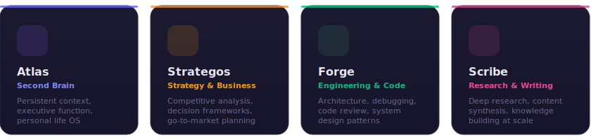

<picture>
  <source media="(prefers-color-scheme: dark)" srcset="assets/banner-dark.svg">
  <source media="(prefers-color-scheme: light)" srcset="assets/banner-light.svg">
  
</picture>

<div align="center">

<br>

[](LICENSE)
[](https://www.electronjs.org/)
[](https://github.com/ChrisJDiMarco/jarvis-universal)
[](https://claude.ai)

**Manage multiple AI intelligences from one dashboard.**<br>
**Each mind has its own personality, memory, and skills.**

[Quick Start](#-quick-start) &nbsp;&middot;&nbsp; [Starter Minds](#-starter-minds) &nbsp;&middot;&nbsp; [Features](#-features) &nbsp;&middot;&nbsp; [Orchestration](#-orchestration) &nbsp;&middot;&nbsp; [How It Works](#-how-it-works) &nbsp;&middot;&nbsp; [Shortcuts](#-keyboard-shortcuts)

<br>

</div>


<br>

## ⚡ Quick Start

JARVIS OS ships inside [JARVIS Universal](https://github.com/ChrisJDiMarco/jarvis-universal). From the repo root:

```bash
scripts/start_jarvis_os.sh        # installs deps on first run, then launches

# or run it directly:
cd apps/jarvis-os && npm install && npm start
```

Run `npm test` before shipping changes. It exercises syntax checks, inline UI script parsing, persistence normalization, path guards, MCP access controls, and renderer/main IPC contracts without launching Electron.

> On first launch, JARVIS OS presents the **Starter Pack** — 4 pre-built minds ready to install. Pick a folder, click install, and you're operational.

<br>


<br>

## 🧠 Starter Minds

JARVIS OS ships with 4 expertly-crafted minds, each with its own `soul.md` identity, `CLAUDE.md` routing, and memory templates.

<br>

<div align="center">
  
</div>

<br>

<table>
<tr>
<td width="25%" valign="top">

### 🧠 Atlas
**Your Second Brain**

Personal executive OS. Remembers what you forget, connects what you miss, thinks alongside you on everything from daily planning to life decisions.

`Strategy` `Planning` `Memory` `Decisions` `Life OS`

</td>
<td width="25%" valign="top">

### ♟️ Strategos
**Strategy & Business**

Competitive analysis, go-to-market planning, decision frameworks, OKRs. Thinks in competitive landscapes and market dynamics.

`Strategy` `Business` `Planning` `GTM` `Decisions`

</td>
<td width="25%" valign="top">

### ⚒️ Forge
**Engineering & Code**

Architecture, code review, debugging, system design. The co-pilot every engineer wishes they had. Ships code and thinks in systems.

`Engineering` `Code` `Architecture` `DevOps` `Systems`

</td>
<td width="25%" valign="top">

### ✍️ Scribe
**Research & Writing**

Deep research, long-form writing, knowledge synthesis. Transforms raw information into clear, compelling knowledge.

`Research` `Writing` `Content` `Analysis` `Knowledge`

</td>
</tr>
</table>

<br>


<br>

## ✨ Features

<table>
<tr>
<td width="50%" valign="top">

### 🎛️ Mind Management
Create, edit, duplicate, and delete minds through a visual interface. Duplicate copies the full mind folder and memory while pausing copied schedules. Renames keep workflow references linked; folder relinks validate the target and preserve memory verification by relative path; deletes warn about affected workflows and mark their steps for review. Start from templates (Researcher, Strategist, Builder, Writer) or build from scratch with custom personalities and specialties.

</td>
<td width="50%" valign="top">

### 📊 Intelligence Pulse
Real-time readiness dashboard tracking required context files, memory freshness, mesh setup, workflow validity, and capability coverage across all your minds. Missing core files can be repaired directly from Pulse.

</td>
</tr>
<tr>
<td width="50%" valign="top">

### 🧬 Memory Viewer
Browse, edit, and mark memory files as verified directly in the app. Vitality badges show freshness status (fresh / aging / stale) so you know when context needs review.

</td>
<td width="50%" valign="top">

### 🚀 Session Launch
One-click launch into Claude with any mind's folder context. JARVIS OS opens Claude Desktop via deep links — Claude reads the mind's `CLAUDE.md` and becomes that intelligence.

</td>
</tr>
<tr>
<td width="50%" valign="top">

### ⌨️ Command Palette
`Cmd+K` opens a context-aware command surface across minds, views, readiness repairs, stale memories, workflows, and actions. Operate JARVIS OS without hunting through panels.

</td>
<td width="50%" valign="top">

### 🌙 Dark Mode
Full dark theme with carefully tuned contrast ratios. Persists across sessions. Follows your system preference or toggle manually.

</td>
</tr>
<tr>
<td width="50%" valign="top">

### 💡 Readiness Engine
Turns live JARVIS OS state into actionable checks: missing routing files, stale memory, unregistered MCP, invalid schedules, broken workflows, and tool coverage gaps. Dismiss low-priority items or jump straight to the fix.

</td>
<td width="50%" valign="top">

### 🏗️ Prompt Blueprint
Visualize the 6-layer prompt architecture: identity core, critical context, workspace config, session memory, domain context, and runtime state.

</td>
</tr>
</table>

<br>


<br>

## 🔗 Orchestration

JARVIS OS isn't just a mind manager — it's an orchestration platform. Five interconnected systems let your minds collaborate, share context, and work autonomously.

<table>
<tr>
<td width="50%" valign="top">

### ⚡ Mind Mesh + MCP Server
**Real inter-mind communication.** Minds send handoffs, queries, broadcasts via a local MCP server (`cortex-mcp-server.js`). Claude Desktop sessions connect automatically — each mind gets `check_inbox()`, `send_to_mind()`, `get_shared_context()`, and more. Messages also deliver to `owners-inbox/` as markdown files. SVG network graph visualizes connections.

</td>
<td width="50%" valign="top">

### 📋 Workflow Pipelines (CLI-Powered)
**Real execution via Claude CLI.** Build multi-step pipelines, hit Run, and JARVIS OS spawns `claude -p` for each step — pointed at the mind's folder so CLAUDE.md auto-loads. Workflows are preflighted for missing minds and empty steps before execution. Output from each step pipes as context to the next, with live status updates, expandable output, cost tracking, and cancellation.

</td>
</tr>
<tr>
<td width="50%" valign="top">

### ▶️ Run Mind (Programmatic Execution)
**Two modes per mind.** "Open Session" launches interactive Claude Desktop cowork (unchanged). "Run Mind" spawns a single-shot Claude CLI call — type a prompt, get a result, see duration and cost. The CLI building block that workflows use under the hood.

</td>
<td width="50%" valign="top">

### 🔗 Shared Memory + Access Control
**Cross-mind context layer.** Three shared markdown files (context, decisions, projects) accessible by all minds. Per-mind access control (read/write, read-only, none). Minds can read and update shared memory via MCP tools.

</td>
</tr>
<tr>
<td width="50%" valign="top">

### 🔌 MCP Tool Registry
**Declare which tools each mind can access.** 13 MCP tools across 5 categories — Slack, Gmail, GitHub, Firecrawl, Google Calendar, and more. Toggle connections per mind. JARVIS OS writes each mind's current capabilities to `memory/cortex-capabilities.md` so Claude can read the same permissions the UI shows.

</td>
<td width="50%" valign="top">

### ⏰ Scheduled Operations
**Autonomous recurring tasks.** Add schedules to any mind with human-friendly intervals (30m, 6h, 1d). Node.js timers trigger Claude CLI runs with that mind's folder context, record completion/error status, and prevent overlapping runs. Enable/disable per schedule.

</td>
</tr>
</table>

<br>


<br>

## 🔧 How It Works

Each mind is a folder on disk. JARVIS OS manages the metadata — Claude reads the files.

```
~/JARVIS OS/atlas/
├── CLAUDE.md                  # Routing instructions — what Claude reads first
├── mind.json                  # Metadata for JARVIS OS (name, icon, color, tags)
├── memory/
│   ├── soul.md                # Identity, personality, operating philosophy
│   ├── L1-critical-facts.md   # High-priority facts loaded every session
│   └── cortex-capabilities.md # JARVIS OS-managed tools, mesh, shared-memory access
├── .claude/agents/            # Agent configurations
├── owners-inbox/              # Pending items for the mind to process
├── skills/                    # Skill definitions and procedures
└── logs/                      # Session logs and digests
```

**The flow:**

```
You click "Open Session"
    → JARVIS OS launches Claude Desktop with the mind's folder
        → Claude reads CLAUDE.md (routing)
            → CLAUDE.md says "read memory/soul.md"
                → Claude becomes that mind
```

> **Why folders?** Because they're portable, version-controllable, and work with any tool. Your minds are plain files — not locked in a database.

<br>


<br>

## ⌨️ Keyboard Shortcuts

| Shortcut | Action |
|:---------|:-------|
| <kbd>⌘</kbd> <kbd>K</kbd> | Command Palette |
| <kbd>⌘</kbd> <kbd>N</kbd> | New Mind |
| <kbd>⌘</kbd> <kbd>,</kbd> | Settings |
| <kbd>⌘</kbd> <kbd>P</kbd> | Pulse Dashboard |
| <kbd>Esc</kbd> | Close panels & modals |

<br>


<br>

## 📐 Architecture

Zero build step. Three files. One HTML page.

```
cortex/
├── main.js                  # Electron main — IPC, CLI orchestration, mesh watcher
├── preload.js               # Context bridge — secure renderer ↔ main comms
├── index.html               # The entire UI — styles, markup, and logic
├── cortex-mcp-server.js     # MCP server — inter-mind messaging for Claude Desktop
├── scripts/smoke-test.js    # Dependency-free reliability smoke suite
├── package.json             # Electron 30.5, zero other dependencies
└── minds/                   # Starter mind templates (copied on first run)
    ├── atlas/
    ├── strategos/
    ├── forge/
    └── scribe/
```

**Persistence** lives at `~/.cortex/`:

| File | Purpose |
|:-----|:--------|
| `state.json` | Theme, window bounds, default folder, shared memory config |
| `minds.json` | Mind registry — names, paths, schedules, tool connections |
| `mesh.json` | Inter-mind message history |
| `workflows.json` | Workflow pipeline definitions |
| `shared-memory/` | Shared markdown files accessible by all minds |

JSON state writes use atomic temp-file replacement and keep `.bak` recovery copies, so a partial write does not strand the app in a broken state. Core UI mutations check save results before showing success and roll back unsaved registry changes. The Electron boundary normalizes known state, mind, workflow, and activity shapes on load/save so malformed-but-parseable JSON does not leak into the interface. File and process IPC is guarded to JARVIS OS-managed mind/shared-memory roots, protected folders are refused, and MCP shared-memory tools use explicit file allowlists.

<br>


<br>

## 📋 Requirements

| Requirement | Details |
|:------------|:--------|
| **macOS** | Native `hiddenInset` titlebar with traffic lights |
| **Node.js** | v18 or higher |
| **Claude Desktop** | For launching mind sessions via `claude://` deep links |

<br>


<br>

<div align="center">

## 🤝 Contributing

JARVIS OS is open source under the [MIT License](LICENSE).

Fork it, build your own minds, and share what you create.

<br>

**Built by [the operator DiMarco](https://github.com/ChrisJDiMarco)**

<br>

<sub>If JARVIS OS helps you think better, give it a ⭐</sub>

</div>
