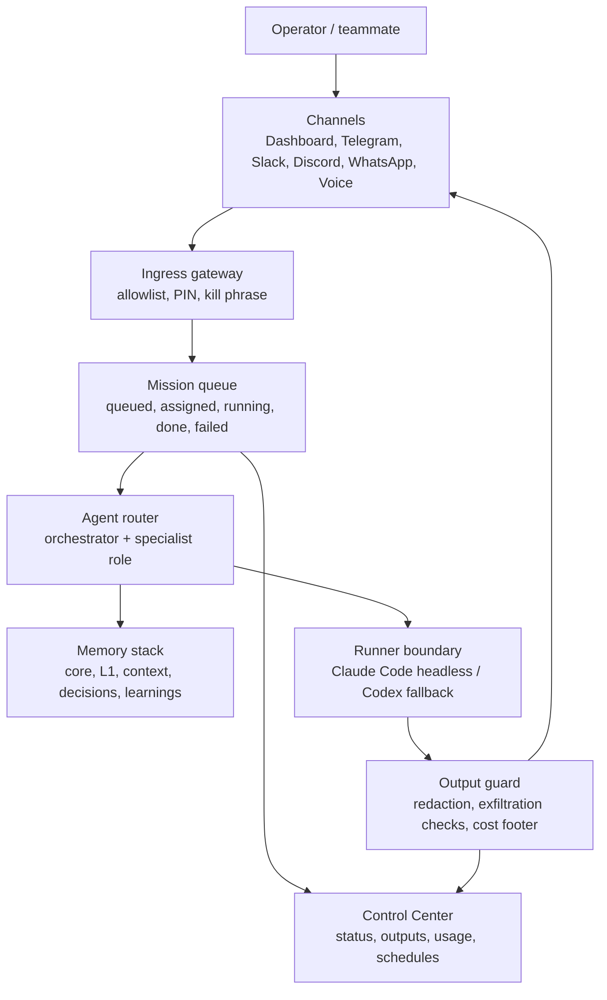

# JARVIS Control Plane Gap Audit

Date: 2026-05-05

## Verdict

JARVIS already has the agentic brain: memory, agents, skills, hooks, inboxes, and operating rules. What is still lacking is the OS shell: a visible command center, a task queue, channel bridges, a safe runner, usage observability, and optional voice/meeting surfaces.

In plain terms: the current repo is strong when an operator points Claude Code, Cowork, Codex, or another agent at the folder. It is not yet the full ClaudeClaw-style interface where a non-technical user can open a dashboard or mobile chat, press a button, and watch missions route through a secure queue.

## Reference Signals

Sources reviewed:
- Local PDF: `/Users/chrisdimarco/Downloads/ClaudeClaw_v2_Visual_Guide.pdf`
- Video reference: `https://www.youtube.com/watch?v=pfPi04pIfaw&list=PLfGSZOW76tbnP-tpT1Xdldbg5ymjslTnD&index=8&t=958s`
- Study guide for the video: `https://wfu-cer-ait-ua-internal.s3.us-east-1.amazonaws.com/wm/video-study-guides/claude-code-agentic-os-unstoppable-study/claude-code-agentic-os-unstoppable-study.html`
- Claude Agent SDK overview: `https://code.claude.com/docs/en/agent-sdk`
- Claude Code settings: `https://code.claude.com/docs/en/settings`
- Claude Code hooks reference: `https://code.claude.com/docs/en/hooks`

The video frames an agentic OS as four layers:
1. Memory that persists without requiring a heavyweight RAG stack.
2. Skills organized like an org chart so repeatable work is consistent.
3. Automations split into local and remote execution based on file/CLI needs.
4. A command-center dashboard that turns skills and automations into visible buttons and run outputs.

The ClaudeClaw v2 guide adds the missing "OS interface" layer:
1. Multi-channel entry points such as Telegram, Slack, WhatsApp, Discord, dashboard, and voice room.
2. Mission Control queue with assign/running/done states.
3. Five visible specialist agents with a shared hive memory.
4. Security gates: allowlist, PIN, exfiltration guard, kill phrase, and audit trail.
5. Cost footer and usage feedback on each run.
6. Process boundary where a local service invokes real Claude Code sessions and returns structured JSON.
7. War Room voice routing with pinned/default/team broadcast modes.
8. Meeting assistant that preloads calendar, email, and memory context.

## What JARVIS Already Has

| Layer | Current Status |
|-------|----------------|
| Memory | Strong. Four-layer markdown memory plus BM25/semantic retrieval fallback. |
| Skills | Strong. Large skill library with domain and ECC technical playbooks. |
| Agents | Strong for Claude Code. Project agents have `.claude/agents/` definitions and portable Codex fallback via `AGENTS.md`. |
| Hooks | Functional. Precompact and stop hooks support memory recovery and MetaClaw learning. |
| Inboxes | Present. `owners-inbox/` and `team-inbox/` give the system a human review surface. |
| Directories | Present. Projects, docs, assets, n8n configs, memory, and logs are available. |

## Gaps To Close

| Gap | Why It Matters | Required Artifact |
|-----|----------------|-------------------|
| Command Center UI | Non-technical users need a front door that is not the terminal. | `apps/control-center/` web app |
| Mission queue | Agents need visible task lifecycle and retry state. | SQLite-backed `missions`, `runs`, `events` tables |
| Headless runner bridge | Dashboard/channels need a safe way to launch Claude Code/Codex work. | `runtime/runner/` process boundary with JSON contract |
| Channel gateway | The OS needs mobile/team entry points. | `runtime/channels/` adapters, starting with one channel |
| Security policy engine | Remote access without allowlists and redaction is not acceptable. | `runtime/security/` allowlist, PIN, exfiltration checks, kill switch |
| Cost/usage ledger | Operators need feedback on what ran and what it cost. | `runtime/usage-ledger/` per-run records and UI footer |
| Automation registry | Local vs remote execution needs to be explicit per skill. | `automation.yaml` or SQLite registry |
| Memory browser | Existing memory is powerful but not visible. | UI for L0-L3 memory, recent learnings, and search |
| War Room voice | The PDF's voice-room layer is absent. | Optional `runtime/voice-room/` prototype |
| Meeting assistant | Calendar/email/memory preflight exists as a concept, not a runtime bot. | Optional `runtime/meeting-assistant/` |

## Target Architecture

## Build Sequence

### Phase 0: Contracts
Create the data contracts before writing UI:
- `Mission`: id, source, operator, prompt, target_agent, status, priority, created_at.
- `Run`: mission_id, runtime, command, cwd, started_at, ended_at, exit_code, token/cost estimates.
- `Event`: mission_id, type, message, payload, created_at.
- `SecurityDecision`: allow, deny, needs_pin, redacted_fields, reason.
- `AgentResponse`: summary, artifacts, followups, cost_footer, raw_log_path.

### Phase 1: Command Center MVP
Build a local web UI that can:
- Show active missions, recent runs, owner inbox items, and memory search.
- Create a mission from a prompt plus selected agent/skill.
- Render run logs and final outputs.
- Show upcoming scheduled automations and heartbeat status.

### Phase 2: Safe Runner
Add a process boundary that can launch the local agent runtime:
- Primary for Claude Code: use non-interactive/headless mode with explicit `cwd`, allowed tools, and structured output.
- Codex fallback: use the current runtime's local CLI/API if available, otherwise stage the mission for manual execution.
- Always write raw logs and structured summaries separately.

### Phase 3: Channel Gateway
Start with one channel, then generalize:
- Inbound message -> identity check -> optional PIN -> mission classification -> queue.
- Outbound response -> redaction -> cost footer -> channel delivery.
- Each channel adapter must share the same `Mission` contract.

### Phase 4: Security Bar
Implement these before any broad remote access:
- Operator allowlist per channel.
- High-risk action PIN challenge.
- Emergency kill phrase that pauses all inbound execution.
- Exfiltration guard for secrets, env files, credentials, private keys, and sensitive memory.
- Append-only audit log for all remote-triggered actions.

### Phase 5: Memory And Skill Packaging
Expose the repo's strongest assets in the UI:
- Org-chart view of agents and skills.
- Packaged buttons such as Research Pack, Content Pack, Builder Pack, Ops Pack.
- Memory browser with search, recent learnings, and source links.
- One-click "create skill from this repeated workflow" handoff.

### Phase 6: War Room Voice
Optional after dashboard/channel foundations are stable:
- Browser voice room with named agents.
- Router modes: default main agent, pinned agent, explicit agent prefix, and team broadcast.
- Keep the voice layer as an adapter over the same mission queue, not a separate brain.

### Phase 7: Meeting Assistant
Optional after calendar/email integrations are confirmed:
- Preflight brief from calendar, email, and memory.
- Join/assist flow only where permissions and platform policies allow it.
- Post-meeting summary routed to memory and owners-inbox.

## Design Rules

1. The UI is a control surface, not the brain. The source of truth remains repo files, memory, and the mission database.
2. Every button must map to a skill, agent, or automation contract. No mystery actions.
3. Remote channels may enqueue work by default; direct execution requires allowlist and security policy.
4. The runner must be swappable: Claude Code first, Codex fallback, manual fallback.
5. Cost, risk, and output destination should be visible before and after each run.
6. Do not build voice or avatars before the mission queue, runner, and security layer exist.

## Definition Of Done

The system becomes an "AI OS" in the visible sense when a user can:
1. Open a dashboard and see agents, skills, missions, memory, schedules, and recent outputs.
2. Start a mission from the dashboard without touching the terminal.
3. Send a message from at least one external channel and receive a safe response.
4. Inspect what ran, which agent handled it, what files changed, and what it cost.
5. Pause/kill inbound execution from a clear control.
6. Search memory and launch common skill packs from buttons.
